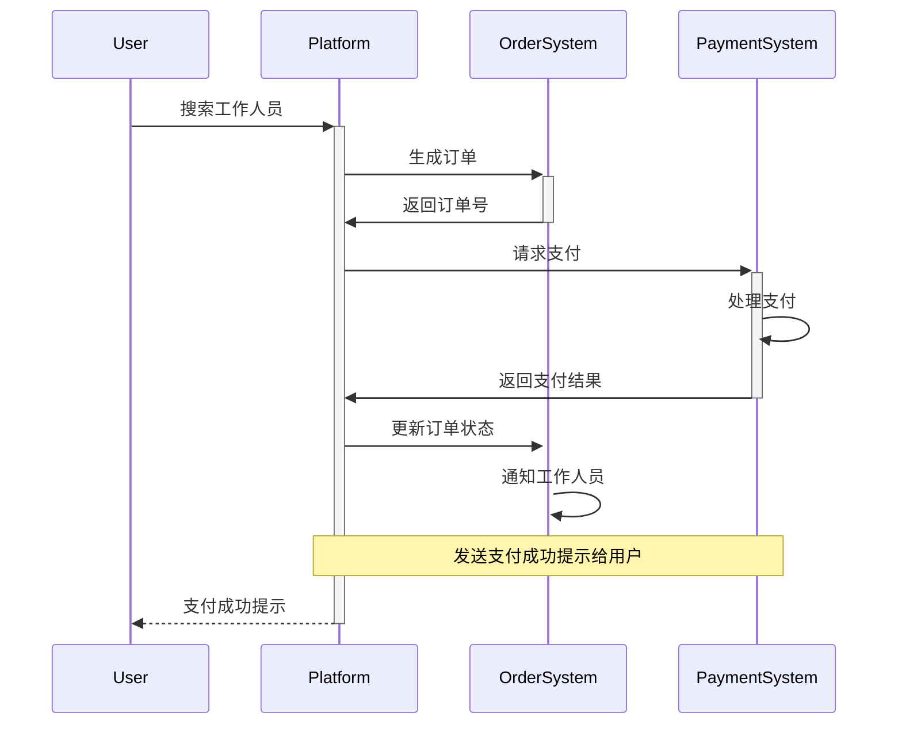

用例图

类图

~~~mermaid
classDiagram
    class User {
        <<Entity>>
        -id: int
        -name: string
        -mobileNo: string
        -address: string
        -balance: double
        -password: string
        +register()
        +login()
        +searchWorker()
        +makeAppointment(workerId: int, orderInfo: string)
        +getOrders()
        +pay(orderId: int)
        +cancelOrder(orderId: int)
    }
    class Worker {
        <<Entity>>
        -id: int
        -name: string
        -mobileNo: string
        -address: string
        -rating: double
        -password: string
        +register()
        +login()
        +getOrders()
        +acceptOrder(orderId: int)
        +completeOrder(orderId: int)
    }
    class Admin {
        <<Entity>>
        -id: int
        -name: string
        -mobileNo: string
        -password: string
        +addWorker(workerInfo: string)
        +deleteWorker(workerId: int)
        +editWorker(workerInfo: string)
    }
    class Order {
        <<Entity>>
        -id: int
        -userId: int
        -workerId: int
        -serviceDate: date
        -status: string
        -amount: double
        +create(userId: int, workerId: int, serviceDate: date, orderInfo: string)
        +calculateAmount(serviceDate: date, orderInfo: string)
    }
    User --> Order : 订单
    Worker --> Order : 订单
    Admin --> Worker : 管理员可以对家政工进行管理

    class Comment {
        <<Entity>>
        -id: int
        -userId: int
        -workerId: int
        -createTime: datetime
        -content: text
        +create(userId: int, workerId: int, content: text)
    }
    User --> Comment : 用户可以对家政工进行评价
    Comment --> Worker : 家政工会收到评价信息
    
~~~

